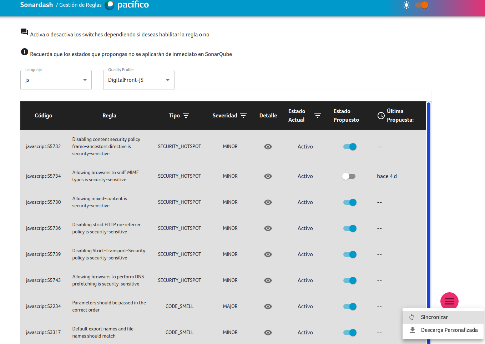

# Rules Admin Dashboard

This project provides a user-friendly interface for managing lint rules provided by SonarQube. The tool includes a table that displays all the available rules and allows users to filter, search, and download reports. The tool also supports the activation and deactivation of rules according to a quality profile.

Data is fetched from supabase.

For more information:

- [Supabase documentation](https://supabase.com/docs)
- [SonarQube documentation](https://docs.sonarqube.org/9.9/)



## Content

1. [Features](#features)
2. [Installation](#installation)
3. [Troubleshooting](#troubleshooting)
  3.1. [Fetch client](#why-is-there-a-vite_type_client-env)
  3.2. [Supabase integration](#i-dont-have-a-supabase-server-to-fetch-data-from)
4. [Credits]
5. [Road map](#road-map)

## Features

- View and manage SonarQube rules by Quality Profile
- Filter and search rules based on criteria such as severity of the rule and type
- Activate or deactivate rules according to a quality profile
- Download reports in csv
- Preview of the description of the rule

## Installation

You shall need Yarn 1 (Classic) to install the needed packages after cloning the repository

For more detailed information to install yarn, visit Yarn installation [page](https://classic.yarnpkg.com/lang/en/docs/install/#debian-stable)

If you already have yarn installed, just install the packages

```bash
yarn
```

Then, create a **`.env`** file into the root of the app, setting the correct environment variables, you can find an example in **`.envexample`**.

After that, tho start the project in development mode:

```bash
yarn dev
```

Vite should now prompt into your terminal a message about the url (something like <http://localhost:1234>) to acces the main view

## Troubleshooting

It is common to forget to install first the needed packages, please remember to use `yarn` when it is first time cloned the repository or maybe when updating it, there could be new packages needed

In addition, the mos common error is to forget to set correctly the environment variables into **`.env`** file, double check them

### Why is there a VITE_TYPE_CLIENT env?

The possible values for that env are 'supabase', 'axios' or just don't set it, the default value is 'axios'

This env is to config which service is going to be acting as the fetcher of supabase data.
The reason is because we have plans to code a second way to fetch data using mock servers, and the supabase client shan't be suitable for that goal
(This is for integration tests)

### I don't have a supabase server to fetch data from

We have another project which contains ETLs and migration scripts but it is not just finished yet.
In the meantime, there is a [collection of scripts](./doc/TABLES.md) to run into your sql editor in supabase to bootstrap needed tables.

Till we finish the backend needed project, you should migrate data by your own to supabase.

Supabase, when creating the tables via the scripts, doesn't recognizee camel case fields, you may tweak them manually.

## Credits

This was created and maintained by [Piero](https://github.com/Shadowrunner11)

## License

This project is under MIT License

## Contributing

Anyone can contribute by forking and sending a pr, a reviewer would take care of it and respond in 48 hours, tops

## Road map

- [] Translate documentation to locale es-ES
- [] Finish backend ETLs
- [] Add actions to auto check prs
- [] Write unit tests
- [] Write procedural documentation (wiki)
- [] Add support for real time
- [] Add support for diff check before sync
- [] Add support for PWA install
